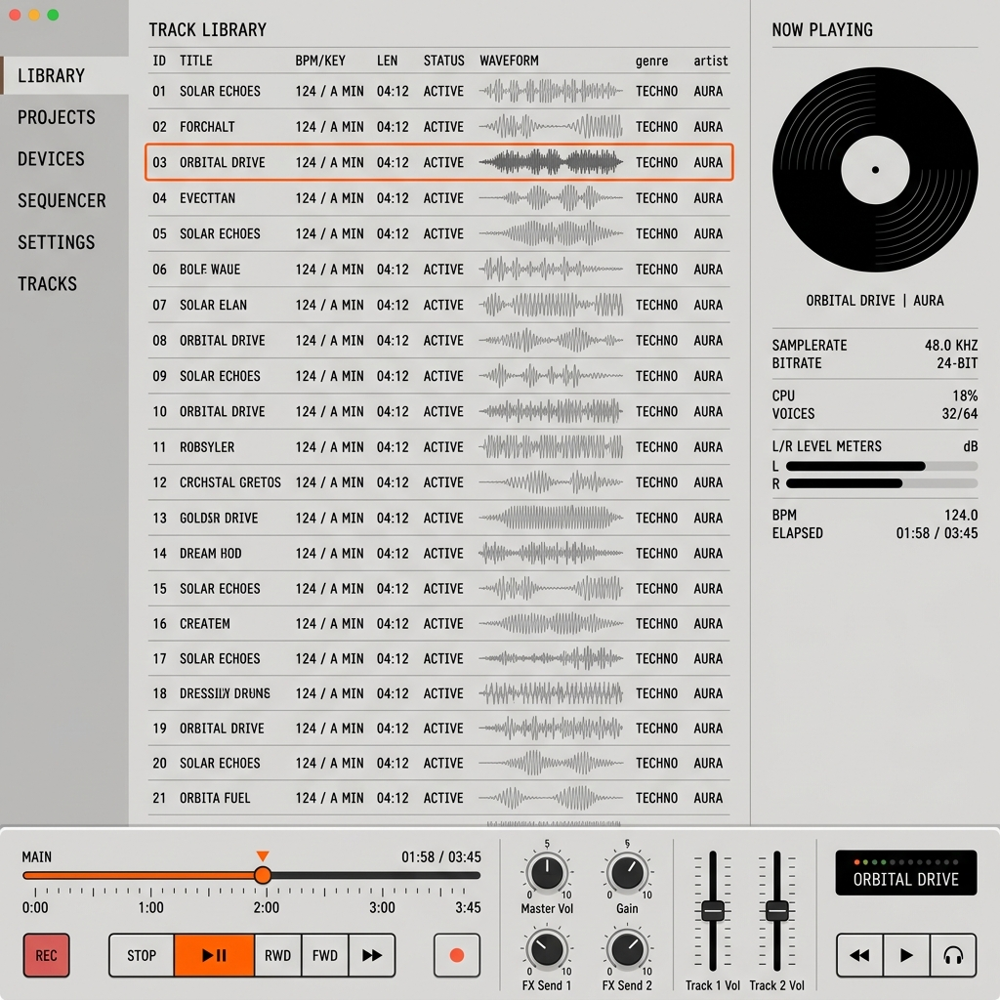

# 织 · Loom —— Teenage Engineering (TE) 极简工业风格 UI 规范

本规范旨在定义“织 · Loom”文件管理平台的界面风格与交互隐喻。我们的目标是构建一个看起来像“精密音频工作站/声卡硬件”而非普通应用软件的极简视觉系统。

---

## 🎨 视觉设计图预览 (Mockup Preview)

---

## 一、 核心设计哲学

1. **绝对结构化（Strictly Grid-Driven）**：整个界面依靠严谨的网格（Grid）和细边框对齐划分，没有模糊边界，不使用卡片式阴影。
2. **反过度修饰（Zero Decoration）**：严禁使用渐变色、毛玻璃（Glassmorphism）、大圆角或装饰性阴影。每个元素必须看起来有“物理功能”。
3. **高密度信息（Compact Density）**：紧凑的字距与行距，提供专业级监视仪般的密集参数信息。
4. **quiet luxury 与工具感**：不迎合消费级应用软件的娱乐化感官，呈现出极其克制、专业且冷峻的生产力工具质感。

---

## 二、 基础视觉系统 (Design Tokens)

### 1. 色彩矩阵 (Color System)
我们使用极致克制的“黑白灰 + 单一指示灯橙色”的色板系统：

| 变量名 | 默认值 (Light Mode) | 默认值 (Dark Mode) | 物理隐喻 / 使用场景 |
| --- | --- | --- | --- |
| `bg-base` | `#f5f5f3` (温暖浅灰) | `#121212` (哑光黑) | 硬件底座机壳、外框背景 |
| `bg-surface` | `#ffffff` (纯白) | `#1e1e1e` (枪灰色) | 控制台功能面板、交互组件面 |
| `text-primary` | `#111111` (Near-Black) | `#eeeeee` (亮银白) | 主文字、主要参数数值 |
| `text-secondary`| `#707070` (中灰) | `#909090` (中灰) | 硬件刻度、副标题、非活动参数 |
| `border-light` | `#e5e5e3` (浅细线) | `#2d2d2d` (暗细线) | 1px 细边框，用于面板切割 |
| `accent` | `#ff5c00` (霓虹橙) | `#ff6611` (霓虹橙) | 物理激活指示灯、当前音轨状态 |

### 2. 边框与物理结构
*   **0px 阴影**：全局禁用 `box-shadow`（包括按钮悬浮和弹窗），仅在需要模拟凹陷物理槽位（例如音量滑块槽）时，允许使用 `inset` 内阴影：
    *   *Tailwind 类*：`shadow-[inset_0_1px_2px_rgba(0,0,0,0.1)]`
*   **直角圆角**：除了极个别组件（如完全圆形的小指示灯），大部分面板、输入框和按钮的圆角控制在 `0px` 到最大 `2px` 内。

### 3. 字体排印 (Typography)
*   **主字体**：系统原生无衬线字体（`Inter` / 苹方 / 微软雅黑）。
*   **等宽字体 (重点)**：任何系统参数标签、数值、时间、比特率以及表格内容，必须强制使用等宽字体（推荐 `JetBrains Mono` 或 `SF Mono`），并开启等宽数字特性：
    *   *CSS 属性*：`font-variant-numeric: tabular-nums`
*   **SECTION 大写**：所有分类标题、侧边栏父级和表格头部文字，必须使用**全大写 (Uppercase)** 和 `text-[10px]` 小字体，配合 `tracking-widest` 宽字距，营造硬件控制面板丝印的效果。

---

## 三、 精密组件与交互隐喻 (Components & Metaphors)

### 1. 刻度尺进度条 (Timeline Ruler)
进度条应当看起来像一个“精密的物理测深仪”或示波器刻度。
*   **设计**：下方带有一排高低交错的刻度线（Tick Marks），播放时橙色的极简圆形小指示器滑块（Slider Knob）在其上精准移动。
*   **交互**：点击刻度轨道可无缝进行 `seek` 寻轨，鼠标悬停时当前刻度的绝对时间（秒）以超小字体浮现。

### 2. 物理旋转旋钮 (Analog Rotary Knobs)
用于音量、缩放等连续参数的调整。
*   **视觉**：渲染为一个纯白或纯黑的圆形面板，其上带有一条 1px 的极细橙色指向线（Pointer 线）。
*   **交互**：支持在旋钮上点击并向上/向下拖拽鼠标来调整参数，同时旋钮根据参数比例进行角度旋转（`transform: rotate()`）。

### 3. LED 脉冲指示灯 (LED Status Indicators)
*   **播放状态指示**：界面最顶部状态栏和Now Playing的“ACTIVE”字样旁，带有一个 6px 见方的纯圆形指示灯。
*   **动效**：
    *   当 `PLAYING` 时：指示灯呈橙色，并带有轻微的呼吸脉冲动画（`animate-pulse`），闪烁频率与音频拍率同步（默认 1.5s 周期）。
    *   当 `READY/PAUSE` 时：指示灯呈哑光中灰色，静止不闪烁。

### 4. 音轨波形仪 (Micro Waveform Chart)
*   **列表波形**：在当前激活的音轨行，标题旁展示一段 32px 宽的微型 SVG 波形图。
*   **动效**：未播放时，展示为静止的等高横线；播放时，SVG 内的三条竖状频段条进行轻微的跳动（`animate-bounce`），模拟模拟电平表 (VU Meter) 效果。