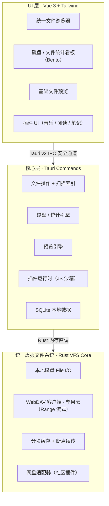
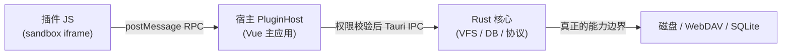

# 织 · Loom —— BYOS 文件管理平台 · 独立开发计划书

<aside>
🧵

**一句话定位**：织（Loom）是一个**不提供任何云存储**的本地优先**文件管理平台**。它把你连接的多个云盘 / WebDAV / 本地磁盘*编织*（weave）成一个统一视图，提供**文件浏览、磁盘与文件统计、基础预览**等核心能力；音乐、阅读、笔记等更高阶的体验，则通过**插件**在这个文件底座之上按需赋能。

</aside>

## 为什么叫「织 · Loom」

- **Loom = 织布机**：它本身不生产棉花（不存数据），只负责把你已有的各色丝线（各个存储源）编织成一块统一的文件布。这正是 BYOS 理念的隐喻。
- **织（zhī）**：中文单字，冷峻、克制，与「轻音 Lumo」「无用」同属一脉的松弛、不喧哗的命名气质。
- **本质是文件平台，不是播放器**：插件只是在文件底座上生长出来的枝叶。我们只做连接、管理与呈现，不做内容生产，也不碰版权灰色地带。

---

## 一、核心愿景与设计宪法

这是一份会贯穿所有设计决策的"宪法"，任何功能若违背以下原则，一律否决：

1. **数据主权绝对独立**：软件永不提供云端存储，所有数据落在用户自有的本地磁盘 / WebDAV / 网盘里。卸载软件 ≠ 丢数据。这条主权不仅覆盖**源数据**，也覆盖**插件产生的使用数据**（播放列表、阅读进度、闪念笔记等）：它们一律私有、本地、完全归属用户，可随时整体迁移；只要把数据目录指向网盘 / WebDAV，即可实现多端同步、跨平台与在线使用。**没有账号绑定、没有平台锁定——只要数据在，换设备 / 换系统 / 换版本都能无缝衔接。**
2. **本地优先（Local-first）**：离线可用是默认态，网络只是"更多的源"，不是前提。
3. **反订阅**：核心功能一次买断或完全开源，绝不按月勒索。
4. **文件底座 + 插件赋能**：核心永远是文件管理（连接、统计、预览）；音乐/阅读/笔记等一律是构建在文件底座之上的**插件**，按需安装，绝不把功能硬塞进内核变成臃肿的全家桶。
5. **法律洁净**：官方只接入标准、合法的协议；任何"第三方音源/书源"只能由社区以插件形式自担风险，官方不分发、不维护、不背书。

---

## 二、差异化价值（UVP）

| 维度 | 市面主流 | Loom 的不同 |
| --- | --- | --- |
| 定位 | 单一网盘挂载 / 单功能 App | 跨源统一的**文件管理平台** |
| 存储 | 厂商云，绑定生态 | BYOS，用户自有存储，零绑定 |
| 能力扩展 | 封闭，厂商说了算 | 文件底座固定 + JS 插件按需赋能 |
| 体验 | 先下载再使用 | 流式预览，不下载也能看云端大文件 |
| 性能 | Electron 重壳 | Rust + Tauri v2，内存占用低一个数量级 |

---

## 三、技术栈选型

| 层次 | 选型 | 核心理由 |
| --- | --- | --- |
| 应用外壳 | **Tauri v2** | 相比 Electron 内存占用大幅下降，跨端（Win/Mac/Linux），移动端作为后续阶段储备 |
| 核心底层 | **Rust** | 统一虚拟文件系统、文件扫描索引、流式分片、高并发网络与缓存 |
| 前端 | **Vue 3 + Vite + TypeScript** | 用最熟练的 Composition API 快速推进，利用 TypeScript 保证与 Rust 侧 IPC 通信的类型安全与长期可维护性 |
| 样式 | **Tailwind CSS** | 精确落地便当盒统计看板与黑白红极简视觉 |
| 本地数据库 | **SQLite（含 FTS5）** | 单一引擎，文件索引/统计/插件数据全覆盖；**放弃 Sled**，避免多引擎维护负担 |

<aside>
⚠️

**关键澄清（音视频统一原则：宿主侧可选兜底 + 插件纯 JS/WASM）**：音频 / 视频的**解码一律在插件侧用纯 JS/WASM 完成**——优先用浏览器原生 `<audio>` / `<video>` / Web Audio，复杂或冷门格式则由插件自带 **WASM 解码器**，**插件内绝不塞任何原生 / Rust 编解码（Symphonia 既不进插件、也不进内核）**。仅当浏览器与 WASM 都解不动某些格式时，才**可选**回退到**宿主侧 Rust 兜底转码**（基于 Symphonia / FFmpeg，把原始流转成浏览器可播的格式），经受控接口按需调用——**它只是兜底，不是插件运行的前提**。Mini-Player 也是插件装上后才出现的组件，不是文件平台的固有部件。数据库统一用 SQLite；移动端单独立项 v2.0。

</aside>

---

## 四、系统架构（文件底座 + 插件层）



**设计要点**：所有"源"在 VFS 层被抽象成统一的 `Source` trait（本地磁盘、WebDAV、网盘插件一视同仁），上层完全不感知文件来自哪里。**插件只能通过受控的接口访问 VFS 与 UI 槽位，永远跳不出文件底座的沙箱。**

---

## 五、产品结构：一个底座 + 文件核心 + 插件层

### 底座：统一虚拟文件系统（VFS）

- **统一 Source 抽象**：本地磁盘、WebDAV（坚果云）、网盘（插件）均实现同一套 `list / stat / read_range / write` 接口。
- **流式引擎**：基于 HTTP `Range` 的分片拉取，支持 seek、边下边读、本地分块缓存与 LRU 淘汰——既服务于预览，也为未来的音乐/视频插件复用。

### 核心：文件管理（这才是「织」最原始、最先做的部分）

- **多源连接管理**：连接/挂载多个云盘与本地盘，统一展示连接状态。
- **磁盘情况**：每个源的总容量 / 已用 / 剩余，以及占用最多的目录 Top。
- **文件统计**：按类型（图片/音频/视频/文档/其他）、大小分布、数量、最近修改进行聚合分析。
- **统一文件浏览器**：跨源的树形 + 列表浏览、搜索（FTS）、排序、基本文件操作（复制/移动/重命名/删除）。
- **基础文件预览**：图片、文本/Markdown、PDF、音视频（走流式引擎）——**无需任何插件即可用**。

### 插件层：在文件底座之上按需赋能

- **插件机制**：JS 插件 API + 沙箱，只能访问受控的 VFS 与 UI 槽位。
- **官方插件**：音乐播放器（**参考复用 Lumo 脚本与 SQLite schema**）、Epub/PDF 阅读器、闪念笔记。
- **社区插件**：网盘协议适配器、第三方音源/书源（社区自担风险，官方不背书）。

---

## 六、本地数据模型（分层存储：宿主主库 + 每插件独立库）

存储分为两层，互不污染，也让复杂插件不再被一张 kv 表限死：

- **宿主主库 `loom.db`**：只存「织」自己的数据 —— 连接的源、文件索引、磁盘统计、插件注册表。
- **每个插件一个独立库**：`<vault>/.loom/plugins/<plugin_id>/data.db`。插件在自己的库里自主建表 / 建索引 / 建 FTS；宿主只通过受控 API 下发「仅指向该插件自己库文件」的连接，插件跳不出自己的库（沙箱隔离）。整库即一个文件夹，可整体迁移 / 放网盘 / 删除，正呼应「插件数据主权」。

### 宿主主库 `loom.db`

```sql
-- 连接的源（本地盘 / WebDAV / 网盘插件）
CREATE TABLE sources (
  id          INTEGER PRIMARY KEY,
  kind        TEXT NOT NULL,        -- local | webdav | plugin
  name        TEXT NOT NULL,
  config_json TEXT NOT NULL,        -- 端点、凭据（加密存储）
  status      TEXT NOT NULL,        -- connected | offline | error
  created_at  TEXT NOT NULL
);

-- 统一文件索引（扫描后缓存，支撑浏览与统计）
CREATE TABLE files (
  id          INTEGER PRIMARY KEY,
  source_id   INTEGER NOT NULL REFERENCES sources(id),
  vpath       TEXT NOT NULL,        -- VFS 内统一虚拟路径
  name        TEXT NOT NULL,
  ext         TEXT,                 -- 扩展名，用于类型统计
  category    TEXT,                 -- image | audio | video | doc | other
  size_bytes  INTEGER,
  is_dir      INTEGER NOT NULL,     -- 0/1
  mtime       TEXT,                 -- 最近修改
  scanned_at  TEXT NOT NULL,
  UNIQUE(source_id, vpath)
);

-- 磁盘容量快照（每个源一行，看板直读）
CREATE TABLE disk_usage (
  source_id   INTEGER PRIMARY KEY REFERENCES sources(id),
  total_bytes INTEGER,
  used_bytes  INTEGER,
  free_bytes  INTEGER,
  item_count  INTEGER,
  updated_at  TEXT NOT NULL
);

-- 已安装插件（注册表：宿主只记元数据，不存插件业务数据）
CREATE TABLE plugins (
  id             TEXT PRIMARY KEY,    -- 插件唯一标识
  name           TEXT NOT NULL,
  version        TEXT NOT NULL,
  enabled        INTEGER NOT NULL,
  data_dir       TEXT NOT NULL,       -- 该插件独立库所在目录
  schema_version INTEGER NOT NULL DEFAULT 0,  -- 宿主据此驱动迁移
  manifest       TEXT NOT NULL        -- 声明的权限与 UI 槽位
);

-- 文件名全文检索
CREATE VIRTUAL TABLE files_fts USING fts5(name, content='files', content_rowid='id');
```

### 每插件独立库 `data.db`

- **schema 自主**：简单插件可以只在自己库里建一张 kv 表存设置；复杂插件（如音乐播放器）可自由建 `tracks / playlists / playlist_items / play_history / lyrics_cache` 等多张表 + FTS。
- **迁移受控**：插件在 manifest 里声明 `schema_version` 与迁移脚本；宿主对比 `plugins.schema_version` 与 manifest 的 `schemaVersion`，在插件自己的库里按序执行 migration。
- **分层清晰**：插件库只存「使用数据」，文件本体仍由文件底座管理；插件表通过 `vpath` 引用 VFS 路径，不重复存储源数据。

---

## 七、插件系统实现

插件默认**不可信**，能力按「越往下越硬」的三层边界逐级收口：UI 跑在沙箱里，权限经宿主受控下放，真正的边界由 Rust 守住。

### 7.1 三层边界



- **插件只拿到一个 `loom` 全局对象**：访问不到 `window` / `fetch` / `fs`，也碰不到其他插件。
- **宿主 PluginHost** 按 manifest 声明的权限做第一道校验。
- **Rust 核心兜底**：文件读写、开哪个 `data.db`、流式服务都按插件身份限定；前端即使被绕过也越不过 Rust。

### 7.2 运行时选型

| 方案 | 适合 | 取舍 |
| --- | --- | --- |
| **`<iframe sandbox>`  • postMessage** | 有 UI 的插件（**推荐主力**） | 浏览器原生沙箱，UI 直接渲染；靠 CSP + sandbox 属性隔离 |
| **Web Worker** | 纯逻辑 / 后台索引插件 | 无 DOM，消息传递，隔离更干净 |
| **Rust 内嵌 JS 引擎（rquickjs / Boa）** | 需要极致隔离的无头逻辑 | 完全掌控暴露面，但 UI 要另走一套 |

MVP 先用 **iframe + postMessage** 一条路打通，足够撑音乐插件；其余按需再加。

### 7.3 插件包结构与 manifest

一个插件 = 一个文件夹 / zip，side-load 到 `<vault>/.loom/plugins/<id>/`：

```text
com.loom.music/
├── manifest.json
├── index.js        # 入口 bundle（必须是编译后的纯 JS）
├── ui/             # 可选前端资源
└── migrations/     # 001.sql, 002.sql ...
```

```json
{
  "id": "com.loom.music",
  "name": "音乐播放器",
  "version": "1.0.0",
  "entry": "index.js",
  "schemaVersion": 3,
  "permissions": {
    "vfs": ["read"],
    "db": true,
    "net": [],
    "media": ["transcodeFallback"],
    "ui": ["sidebar", "preview:audio", "miniPlayer"]
  },
  "migrations": ["migrations/001.sql", "migrations/002.sql"]
}
```

`permissions` 是这个插件能碰什么的**白名单**，宿主与 Rust 都据此放行。

### 7.4 插件 API（`loom` SDK）

插件能调用的，就这几组受控接口：

```tsx
loom.vfs.list(path)            // 只读它被授权的源
loom.vfs.stat(path)
loom.vfs.streamUrl(vpath, { fallback?: boolean })  // 拿到 loom://stream/<token> 给 <audio>/<video>；默认纯透传交由插件 JS/WASM 解码，fallback:true 时请求宿主侧可选兜底转码
loom.db.query(sql, params)     // 只连它自己的 data.db（见第六节独立库）
loom.db.exec(sql, params)
loom.ui.registerSlot(slot, render)   // sidebar / miniPlayer / preview:<type>
loom.events.on("file.open", cb)      // 宿主广播的受控事件
loom.net.fetch(url)            // 仅限 manifest 声明的域名，经 Rust 代理
```

### 7.5 流式媒体：自定义协议，不走 RPC

音乐 / 视频**绝不能把字节通过 postMessage 搬**（会卡死）。改由 Rust 注册自定义协议：

- `loom.vfs.streamUrl(vpath)` 返回带 token 的 `loom://stream/<token>`；
- Rust 实现该协议并**支持 HTTP Range**，复用第五节的分片流式引擎从 VFS 拉取；
- 插件只需 `audioEl.src = url`，seek / 边下边播全交给 Rust，token限定只能读被授权的文件。
- **传输与解码分离**：Rust 自定义协议只负责**搬字节**（Range 流式），**解码归插件的纯 JS/WASM**；唯有浏览器 / WASM 解不动的冷门格式，才让 `streamUrl` 走 `fallback:true` 触发**宿主侧可选兜底转码**（见第三节），把原始流转成浏览器可直接播放的格式后再交给 `audioEl` / `videoEl`，插件本体无需内置任何原生代码。

### 7.6 UI 槽位与文件类型接管

- `registerSlot("miniPlayer", …)`：宿主在底部槽位挂载插件 iframe；
- `registerSlot("preview:audio", …)`：用户打开音频文件时，预览面交给该插件；
- 未装插件时这些槽位为空，正对应「装了插件才出现 Mini-Player」的设计。

### 7.7 生命周期与迁移

```text
安装：解压 → 校验 manifest/签名 → 写 plugins 注册表 → 跑 migrations
启用：实例化 sandbox iframe → 注入 loom SDK → 调 activate()
停用：卸载 iframe，保留数据
卸载：删插件目录 + 它的 data.db（数据随之干净清除）
```

迁移接第六节：对比 `plugins.schema_version` 与 manifest 的 `schemaVersion`，在插件自己的库里按序执行 `migrations/`。

### 7.8 插件开发语言 (TypeScript vs JavaScript)

虽然插件沙箱在运行时只接受并执行纯 JavaScript (`index.js`)，但我们**官方鼓励并支持使用 TypeScript 开发插件**：
1. **官方类型声明**：将发布 `@loom/plugin-types` npm 包，为全局 `loom` SDK 提供完整的接口类型定义，保证完美的 IDE 提示。
2. **构建管线**：复杂插件的开发流应为 `编写 TS 源码 → 经 Vite/esbuild 编译打包 → 输出单文件 index.js → 分发`。
3. **低门槛兼容**：如果是极其简单的几十行逻辑插件，开发者依然可以直接手写 `index.js`，丰俭由人。

---

## 八、视觉与交互规范（Design Tokens）

> 详见独立的 [teenageEngineeringUI.md](file:///d:/code/rust/loom/teenageEngineeringUI.md) 设计规范文档。
> 整体风格将遵循 Teenage Engineering 启发的专业音频设备与极简工业风。

---

## 九、路线图

<aside>
🎯

**核心原则**：独立开发切忌铺子太大。MVP **只做文件平台本身**（连坚果云 + 本地盘、看磁盘/文件统计、基础预览），插件一律后置。每个阶段产出都可演示。

</aside>

### 阶段 1 · 文件平台内核（MVP）— 约 2 个月

- [ ]  Tauri v2 + Vue 3 空壳，配好 Tailwind 黑白红主题
- [ ]  Rust VFS：本地磁盘 + **坚果云 WebDAV** 连接与扫描索引
- [ ]  统一文件浏览器（跨源树/列表 + 搜索 + 基本操作）
- [ ]  磁盘容量与文件统计看板（Bento）
- [ ]  基础预览：图片 / 文本 / Markdown / PDF
- [ ]  **可演示目标**：连上坚果云，一个界面看清"几个盘、占用多少、什么文件最多"，并能直接预览

### 阶段 2 · 插件机制 + 首个插件 — 约 2.5 个月

- [ ]  JS 插件 API 规范 + 沙箱动态加载，定义 VFS / UI 槽位权限
- [ ]  流式引擎补齐（Range 分片 + 缓存）服务音视频预览与插件；音视频解码遵循「插件纯 JS/WASM + 宿主侧可选兜底转码」，兜底转码作为可选项后置
- [ ]  第一个官方插件：**音乐播放器（参考复用 Lumo 脚本）**
- [ ]  发布首个公开 Alpha，GitHub 开源（MIT）

### 阶段 3 · 更多插件 + 打磨 — 约 2 个月

- [ ]  Epub/PDF 阅读器插件、闪念笔记插件
- [ ]  预览能力扩展（Office / 更多格式）
- [ ]  整体性能调优，桌面端 v1.0 发布

### v2.0（独立立项）· 移动端

- [ ]  Tauri v2 iOS/Android 编译，移动端手势与后台优化

---

## 十、风险登记表

| 风险 | 等级 | 对策 |
| --- | --- | --- |
| 第三方音源/书源版权 | 🔴 高 | 官方只做文件平台与标准协议；源插件由社区自担，不分发不背书 |
| 115 等私有网盘协议易变/封号 | 🔴 高 | MVP 不碰；通过 Alist 等中间层暴露为 WebDAV 间接接入 |
| 范围蔓延导致烂尾 | 🟠 中 | MVP 锁死文件平台本身，插件一律后置；违反设计宪法即否决 |
| 全量扫描大盘性能 | 🟠 中 | 增量扫描 + 后台索引 + SQLite 缓存，避免阻塞 UI |
| WebDAV 各家实现差异 | 🟡 低 | 先以坚果云为基准，再扩展兼容矩阵（Alist/NextCloud/群晖） |

---

## 十一、自媒体内容输出计划

文件平台的技术点同样有看点，适合做"独立开发日记"开篇：

1. **第 1 集**：用 Rust 把几个云盘"编织"成一个统一文件视图 + 磁盘统计看板。
2. **第 2 集**：流式预览——不下载就能看云端大文件。
3. **第 3 集**：开放插件机制 + 第一个音乐插件（联动 Lumo）。

---

## 十二、已定决策

1. **首要 WebDAV 兼容基准 = 坚果云**：MVP 阶段先以坚果云为唯一适配与联调目标，跑通后再扩展到 Alist / NextCloud / 群晖。
2. **开源协议 = MIT**：宽松授权，最大化社区插件生态与二次开发自由度（不强制开源套壳方）。
3. **Loom 与「轻音 Lumo」保持独立，不合并**：两者各自立项；后续开发音乐插件时，**参考复用 Lumo 已有脚本与 SQLite schema**，但不并线为同一产品。
