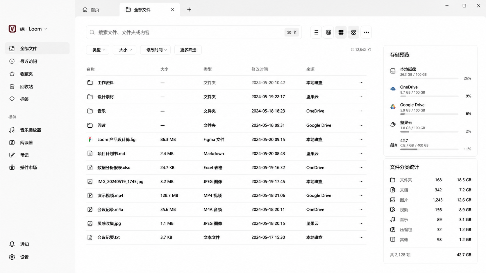

# 🧠 UI设计生成提示词（网盘聚合管理系统）

## 🎯 一、核心描述（主 Prompt）

设计一个现代化的「网盘聚合文件管理系统」桌面端界面，风格为 **极简、轻拟物 + 企业级 SaaS UI**，整体类似 Notion + macOS Finder + Linear 的融合风格。

界面需要支持多云盘（本地磁盘、OneDrive、Google Drive、坚果云等）统一管理，强调信息密度与清晰层级。

---

## 🧱 二、布局结构（Layout）

采用三栏布局：

### 1️⃣ 左侧导航栏（Sidebar）

* 宽度：220–260px
* 顶部：品牌 Logo + 产品名称
* 主导航：

    * 全部文件
    * 最近访问
    * 收藏夹
    * 回收站
    * 标签
* 插件区（分组）

    * 音乐播放器
    * 阅读器
    * 笔记
    * 插件市场
* ❌ 不要顶部“更多/三点菜单”
* 底部固定区：

    * 通知（bell icon）
    * 设置（gear icon）
* 左侧整体为轻灰背景，卡片式分组，hover 有柔和高亮

---

### 2️⃣ 中间主内容区（File Explorer）

* 顶部工具栏：

    * 搜索框（居中，支持快捷键提示 ⌘K）
    * 筛选按钮（类型 / 大小 / 时间 / 更多筛选）
    * 视图切换（列表 / 网格 / 分栏）
* 文件列表采用 **表格 + 轻分割线风格**
* 列字段：

    * 名称
    * 大小
    * 类型
    * 修改时间
    * 来源云盘
* 行 hover 显示操作按钮（更多 / 分享 / 下载）
* 文件夹与文件图标统一线性 icon 风格
* 支持多云盘来源标签（彩色小标签）

---

### 3️⃣ 右侧信息面板（Inspector / Storage Panel）

* 卡片式设计
* 展示：

    * 存储占用（进度条）
    * 多云盘占比（Local / OneDrive / Google Drive / 云盘）
    * 分类统计（文件 / 图片 / 视频 / 音频 / 文档）
* 使用柔和进度条 + 图标
* 卡片圆角 12–16px，轻阴影

---

## 🎨 三、设计风格（Design Language）

### ✨ 风格关键词

* 极简主义（Minimal UI）
* 轻拟物（Soft Neumorphism Lite）
* 企业级 SaaS（Enterprise Dashboard）
* macOS / Linear / Notion 风格融合

---

### 🎨 视觉规范

#### 色彩

* 背景：#F7F8FA / #FFFFFF
* 主色：冷蓝 / 靛蓝（#4F7CFF 或类似）
* 辅助灰：#E5E7EB / #9CA3AF
* 强调色：蓝紫渐变（用于选中状态）

#### 圆角

* 卡片：12px–16px
* 按钮：10px–12px
* 输入框：10px

#### 阴影

* 非强阴影，轻浮层感：

    * blur 12–24px
    * opacity 5–10%

---

### ✏️ 字体系统

* 中文：PingFang SC / Harmony Sans
* 英文：Inter / SF Pro
* 字重：

    * 标题：600
    * 正文：400–500
    * 辅助信息：300–400

---

## ⚙️ 四、交互设计（Interaction）

* hover：轻微背景抬升 + 颜色变化
* click：缩放 98% 微反馈
* sidebar active：左侧蓝色指示条
* 搜索框 focus：柔光蓝边框
* 文件行 hover 出现快捷操作按钮
* 支持拖拽文件进入文件夹
* 支持多选（checkbox hover 出现）

---

## 📦 五、组件风格统一

* 所有 icon：线性风格（Feather / Lucide 风格）
* 卡片：统一白底 + 微边框 #E5E7EB
* 按钮：

    * Primary：蓝色实心
    * Secondary：浅灰填充
* Tag：

    * 圆角 pill shape
    * 不同云盘不同颜色

---

## 🧩 六、整体气质描述（可加在 prompt 最后）

界面应呈现：

> “高信息密度但不杂乱的专业文件管理系统，兼具 macOS 的优雅与 Notion 的结构清晰感，同时具有现代 SaaS 产品的效率导向设计语言。”

## 7.实例
